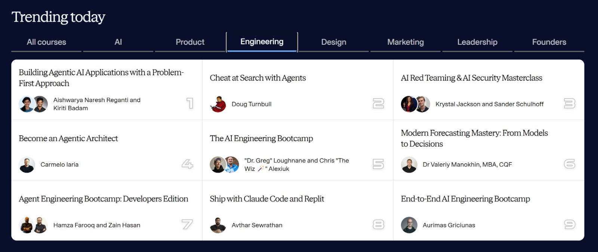

Hi {{ StudentName }},

A few months ago, I had one of those nights you don’t forget.

It was 2 a.m., I was staring at yet another “smart” multi‑agent prototype that looked impressive in a demo and completely fell apart in a real workflow. I’d spent weeks duct‑taping prompts, tools, and agents together. The code compiled, the tests passed, the slide deck looked great—and still the system crashed the moment a real customer or stakeholder touched it.

I remember closing my laptop and thinking: “If this is the future of software, I don’t want it.” I wasn’t burned out on building, I was burned out on building fragile things—solutions that depended on me babysitting a bunch of stubborn AI agents instead of orchestrating a system I could trust.

That night is when the question shifted for me.

Instead of “How do I make this one agent smarter?” I started asking “What would it look like to design the whole system—agents, humans, guardrails, metrics, business goals—as an architect, not just an engineer?” That question pulled me out of vibe‑coding and into what eventually became the Agentic Architect role, the AAMAD framework, and this course.

I didn’t build Become an Agentic Architect because I needed another product. I built it because I wish someone had handed me a structured path back then—a way to turn all that late‑night frustration into a craft, a role, and a career that actually sits above the algorithm instead of competing with it.

What’s been wild over the last months is realizing it’s not just my story.

Scroll through any major social platform right now and you’ll see the same theme, even if people use different labels: senior engineers and tech leads saying “I don’t want to be just a faster coder with AI, I want to own the system, the coordination, the outcomes.” The language changes, but the feeling is identical.

Last week that instinct became very real: hundreds of professionals from around the world joined my 4‑hour O’Reilly live session to dive into The Agentic Architect Playbook—what this role is, the seven core competencies, and how to turn them into a 90‑day plan in their own organizations. O’Reilly has already asked me back for another session on April 28th, which is a strong signal this shift isn’t a niche idea; it’s a movement.

And just a couple of days ago, Maven featured Become an Agentic Architect in the top 9 trending engineering courses on the platform. For me, that’s not about vanity metrics—it’s reassurance that the frustration I felt at 2 a.m. is the same frustration a lot of you are feeling right now, and that the response we’re building together is resonating.

You’re on this waitlist because some part of that story sounds familiar. Over the next days I’ll share more about the structure of the course and how it’s designed to help you make that same shift—from “keeping agents from breaking things” to actually architecting systems your organization can bet on.

For today, I just wanted you to know: this isn’t a marketing concept. It’s the path I had to carve out for myself when the old way stopped working—and it’s the path I’d be excited to walk with you.

Carmelo