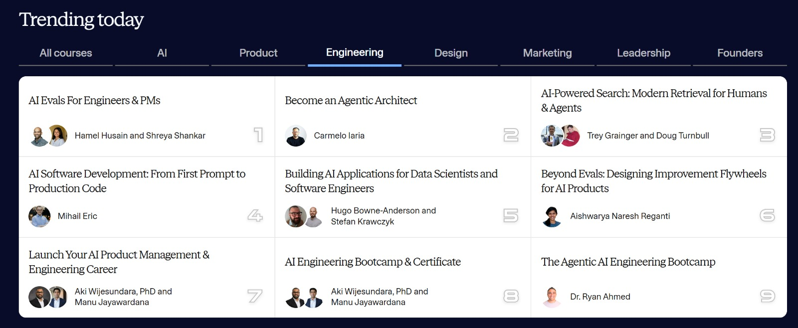

# Broadcast — Learning Roadmap Launch: Choose Your Path

**Date:** 2026-03-03 (Tue)  
**Audience:** Full Gold waitlist (~1,899 contacts)  
**Goal:** Unified launch of Bronze + Silver + Gold as "Agentic Architect Learning Roadmap"; single "choose your path" message.  
**Plan ref:** cohort4-acquisition-plan-2026-03.md → Action 1.1  
**Status:** ✅ Sent. Staggered discount roadmap (EARLYBIRD): 40% by Mar 15, 20% by Mar 29, full price after.

---

## Subject line (choose one)

- **The Agentic Architect Learning Roadmap is live — choose your path**
- **Three ways to become an Agentic Architect (free, live, or full Capstone)**
- **Bronze, Silver, Gold: your path to become an Agentic Architectur starts today**

---

## Body

Hi {{ StudentName }},

Something is happening to software development. Not a distant prediction. Something you can measure in product launches, earnings calls, and the daily experience of millions of developers.

CEOs, research institutes, legendary engineers, and the tools we use every day — they're all arriving at the same conclusion within twelve months.

- 𝗗𝗮𝗿𝗶𝗼 𝗔𝗺𝗼𝗱𝗲𝗶 at Davos: "𝘞𝘦'𝘳𝘦 6–12 𝘮𝘰𝘯𝘵𝘩𝘴 𝘧𝘳𝘰𝘮 𝘈𝘐 𝘥𝘰𝘪𝘯𝘨 𝘢𝘭𝘮𝘰𝘴𝘵 𝘢𝘭𝘭 𝘴𝘰𝘧𝘵𝘸𝘢𝘳𝘦 𝘦𝘯𝘨𝘪𝘯𝘦𝘦𝘳𝘪𝘯𝘨 𝘦𝘯𝘥-𝘵𝘰-𝘦𝘯𝘥. 𝘌𝘯𝘨𝘪𝘯𝘦𝘦𝘳𝘴 𝘢𝘵 𝘈𝘯𝘵𝘩𝘳𝘰𝘱𝘪𝘤 𝘯𝘰 𝘭𝘰𝘯𝘨𝘦𝘳 𝘸𝘳𝘪𝘵𝘦 𝘤𝘰𝘥𝘦 𝘵𝘩𝘦𝘮𝘴𝘦𝘭𝘷𝘦𝘴." On the Nikhil Kamath podcast he clarified: coding goes first, but software engineering shifts to 𝗺𝗮𝗻𝗮𝗴𝗶𝗻𝗴 𝘁𝗲𝗮𝗺𝘀 𝗼𝗳 𝗔𝗜 𝗺𝗼𝗱𝗲𝗹𝘀. The architect role remains. The question: managing the models or being managed out?  

- 𝗠𝗶𝗰𝗵𝗮𝗲𝗹 𝗧𝗿𝘂𝗲𝗹𝗹 (co-founder of Cursor) described "the third era of AI software development": agents that tackle larger tasks independently. 𝟯𝟱% 𝗼𝗳 𝘁𝗵𝗲 𝗣𝗥𝘀 𝗖𝘂𝗿𝘀𝗼𝗿 𝗺𝗲𝗿𝗴𝗲𝘀 𝗶𝗻𝘁𝗲𝗿𝗻𝗮𝗹𝗹𝘆 are now created by agents operating autonomously in cloud VMs. A year ago: 2.5x Tab users vs agent users. Now: 𝟮𝘅 𝗮𝗴𝗲𝗻𝘁 𝘂𝘀𝗲𝗿𝘀 𝗮𝘀 𝗧𝗮𝗯 𝘂𝘀𝗲𝗿𝘀. Agent usage has grown 𝗼𝘃𝗲𝗿 𝟭𝟱𝘅 𝗶𝗻 𝘁𝗵𝗲 𝗹𝗮𝘀𝘁 𝘆𝗲𝗮𝗿. "𝘛𝘩𝘦 𝘩𝘶𝘮𝘢𝘯 𝘳𝘰𝘭𝘦 𝘴𝘩𝘪𝘧𝘵𝘴 𝘧𝘳𝘰𝘮 𝘨𝘶𝘪𝘥𝘪𝘯𝘨 𝘦𝘢𝘤𝘩 𝘭𝘪𝘯𝘦 𝘰𝘧 𝘤𝘰𝘥𝘦 𝘵𝘰 𝘥𝘦𝘧𝘪𝘯𝘪𝘯𝘨 𝘵𝘩𝘦 𝘱𝘳𝘰𝘣𝘭𝘦𝘮 𝘢𝘯𝘥 𝘴𝘦𝘵𝘵𝘪𝘯𝘨 𝘳𝘦𝘷𝘪𝘦𝘸 𝘤𝘳𝘪𝘵𝘦𝘳𝘪𝘢." That's a job description for the Agentic Architect. 

- 𝗦𝘁𝗲𝘃𝗲 𝗬𝗲𝗴𝗴𝗲 talks about eight levels of AI adoption. Engineers stuck at levels 1–3 are most at risk — companies will cut roughly 50% who don't evolve. "𝘈𝘵 𝘭𝘦𝘷𝘦𝘭 8, 𝘺𝘰𝘶'𝘳𝘦 𝘤𝘰𝘯𝘥𝘶𝘤𝘵𝘪𝘯𝘨 𝘢𝘯 𝘰𝘳𝘤𝘩𝘦𝘴𝘵𝘳𝘢." 

- 𝗚𝗿𝗮𝗱𝘆 𝗕𝗼𝗼𝗰𝗵: "𝘊𝘰𝘮𝘱𝘢𝘯𝘪𝘦𝘴 𝘶𝘴𝘪𝘯𝘨 𝘈𝘐 𝘵𝘰 𝘳𝘦𝘱𝘭𝘢𝘤𝘦 𝘦𝘯𝘨𝘪𝘯𝘦𝘦𝘳𝘴 𝘸𝘪𝘭𝘭 𝘴𝘵𝘢𝘭𝘭. 𝘊𝘰𝘮𝘱𝘢𝘯𝘪𝘦𝘴 𝘱𝘶𝘴𝘩𝘪𝘯𝘨 𝘦𝘯𝘨𝘪𝘯𝘦𝘦𝘳𝘴 𝘵𝘰𝘸𝘢𝘳𝘥 𝘢𝘳𝘤𝘩𝘪𝘵𝘦𝘤𝘵𝘶𝘳𝘦 𝘸𝘪𝘭𝘭 𝘱𝘶𝘭𝘭 𝘢𝘩𝘦𝘢𝘥." 

- 𝗞𝗲𝗻𝘁 𝗕𝗲𝗰𝗸: languages don't matter anymore — architecture does.  

- 𝗔𝗻𝘁𝗵𝗿𝗼𝗽𝗶𝗰'𝘀 𝟮𝟬𝟮𝟲 𝗿𝗲𝗽𝗼𝗿𝘁: "𝘚𝘰𝘧𝘵𝘸𝘢𝘳𝘦 𝘥𝘦𝘷𝘦𝘭𝘰𝘱𝘮𝘦𝘯𝘵 𝘪𝘴 𝘴𝘩𝘪𝘧𝘵𝘪𝘯𝘨 𝘧𝘳𝘰𝘮 𝘸𝘳𝘪𝘵𝘪𝘯𝘨 𝘤𝘰𝘥𝘦 𝘵𝘰 𝘰𝘳𝘤𝘩𝘦𝘴𝘵𝘳𝘢𝘵𝘪𝘯𝘨 𝘢𝘨𝘦𝘯𝘵𝘴 𝘵𝘩𝘢𝘵 𝘸𝘳𝘪𝘵𝘦 𝘤𝘰𝘥𝘦."   

I launched Become an Agentic Architect in October 2025. We're now in our third cohort, and several students have already embarked on this journey — designing, building, and deploying production-ready multi-agent applications while the industry is still figuring out what "orchestrator" even means.  

I have seen a great momentum rising in February as the need for this transformation appears clear to more and more professionals that put this course on the Top 2 trending Engineering courses on Maven in February.

Today I'm launching something I've been building toward for months: 

the Agentic Architect Learning Journey— three tiers designed to meet you exactly where you are.  Whether you're exploring the fundamentals, ready for live coaching, or going all-in on a production Capstone, there's a path for you.  

🥉 Bronze (Free) — The Agentic Architect Fundamentals: Start here if you want a structured foundation before going deeper. 

A free self-paced course (4–6 hours) covering the core concepts, a hands-on mini-project, and a certificate you can share on LinkedIn.  

→ Start with Bronze Tier (free) 

🥈 Silver ($349) — Agentic Architect 101:  Two Saturdays, 2 hours live sessions with me each. Live debugging, architecture review, and help translating the framework to a real use case. 

100% of your Silver fee applies as credit toward Gold if you enroll in the next cohort within 4 weeks.  

→ Join the first Silver cohort (Mar 21)

🥇 Gold ($1,995) — Become an Agentic Architect:  The full 6-week Capstone. 

You bring your own project. We design, build, and deploy a production-ready multi-agent AI application — with weekly live sessions, office hours, 1:1 coaching, and a portfolio piece that proves you can ship. 

Cohort 4 starts April 6.  

→ Enroll in by March 15th to get 40% Early Bird Discount  

NOTE: Different discounts will be applied for the Gold offer based on the following schedule:

- Enroll by March 15th: 40% discount ($1,197 instead of $1,995)
- Enroll between March 16th and March 29th: 20% discount ($1,596 instead of $1,995)
- Enroll between March 30th and April 5th: full price ($1,995)

This is the path: Bronze is free. Silver gets you live coaching and a bridge to Gold. Gold is the full transformation. Choose your starting point

Reply to this email if you want to talk through which tier fits your situation. 

I read every message.  

Carmelo

---

## Notes

- **Sources:** Dario Amodei (Davos 2026); WEF "Software Developers: Vanguard of AI" (Jan 2026); Google DORA State of AI-Assisted Software Development; Anthropic 2026 Agentic Coding Trends Report; Grady Booch; Steve Yegge (Pragmatic Engineer). Full list → project-context/research/agentic-architect-momentum-50resources.md.md
- **Maven:** Replace {{ CourseLink }} with Gold enrollment URL; {{ SilverLink }} with https://maven.com/carmelo-iaria/agentic-architect-one-o-one
- **Tone:** Invitational, not urgent. This is a launch announcement — "choose your path" framing. Urgency for Gold/Silver will ramp in later broadcasts.
- **CTAs:** Three distinct links (Bronze, Silver, Gold). Per plan, full Gold waitlist receives this; cold/new leads would emphasize Bronze first.
- **Silver dates:** Mar 21 and Mar 28 (2 hours each session). Gold Cohort 4: Apr 6 start, enrollment closes Apr 5.
